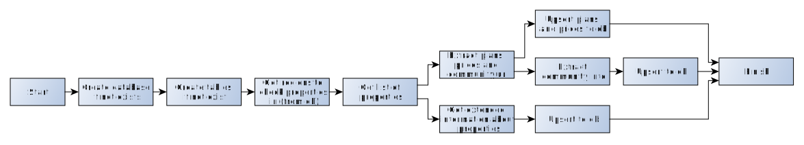

# Present diagram of DAG and explain responsibility of each task in the DAG



## Start

Порожня нода без будь якого функціоналу, створена щоб позначити початок графу

## Create database if not exists

Створює базу для зберігання наших даних, якщо її ще не існує. Якщо ми впевнені, що база вже є - може бути винесена з графу

## Create tables if not exist

Те саме, що й попередня нода, але для таблиць. Також може бути винесена з графу

## Get regions to check properties in (from db)

Отримати з бази даних перелік регіонів, для яких ми хочемо перевірити перухомість. Кожен регіон являє собою прямокутник на карті і має бути представлений парою координат - левого верхнього та правого нижнього кутів

## Get list of properties

Отримуємо перелік обʼєктів власності в кожному регіоні. Для цього нам потрібно зробити запит наступного вигляду (curl наведено в якості прикладу):

```bash
curl 'https://www.buzzbuzzhome.com/api/map/GetPins' \
  -H 'Connection: keep-alive' \
  -H 'Content-Type: application/json; charset=UTF-8' \
  --data-raw '{
      "sellStatus":"fs","homeType":[],"priceMin":0,"priceMax":0,"bdRmCount":[],"conStatus":[],"bathRmCount":"1","compltYear":null,"ownership":null,"sellStatusType":["fs","ir"],"keywords":null,"topLeft":"30.733597551499578,-98.31044006347658","btmRight":"29.85738128021285,-97.15550231933595","requestId":1}'
```

Для proof of concept можемо покласти отримані дані в XCOM

### Extract plans, prices and community url

Отримуємо ціни та плани забудівель, а також посилання на сторінку громади безпосередньо зі сторінки житлового комплексу. Посилання на житловий комплекс отримуємо з результатів кроку **Get list of properties**

`curl https://www.buzzbuzzhome.com/us/fairhaven`

#### Upsert plans and prices to db

Знаходимо по id відповідний обʼєкт в базі даних, якщо він там вже є, та додаємо дані. Якщо його там ще не має - створюємо новий запис

#### Extract community info

Беремо посилання на спільноту з кроку **Extract plans, prices and community url** і простим запитом отримуємо дані

`curl https://www.buzzbuzzhome.com/us/community/fairhaven`

##### Upsert to db

Додаємо дані про спільноту в базу

### Get extended information about properties

Розбиваємо перелік обʼєктів власності на батчі і робимо запити для отримання розширених даних:

```bash
curl 'https://www.buzzbuzzhome.com/api/map/GetFullObj' \
  -H 'Connection: keep-alive' \
  -H 'Content-Type: application/json; charset=UTF-8' \
  --data-raw '{"ids":["98d3f6a6-59c9-4a07-8bc4-d93c84a3f5fe","01b98114-390d-4136-b1a2-35b4a0483962","615699ab-71eb-40da-863f-9d7666abdcda"]}'
```

#### Upsert to db

Додаємо розширені дані до бази даних


# Describe the approach that you plan to use for data extraction

Більша частина даних буде отримана через запити до API, у відповідь на які буде надходити JSON. Інші дані будуть отримані за допомогою звичайних запитів + парсингу HTML

# Propose some mechanism for data caching that will allow you to rerun data transformation without data extraction, when data transformation fails

В найпростішому вигляді, якщо зберігати проміжні дані в XCOM - нам може допомогти механізм ретраїв. У такому випадку будуть перезапускатися задачі з трансформації без необхідності отримання даних знов.

У більш складному випадку ми можемо використовувати kafka і комітити тільки коли задача з обробки завершилася успіхом.

# Describe all third-party tools that you plan to use in your pipeline

У найпростішому вигляді вистачить одного сервера на якому буде розміщена база Postgres для самого Airflow і MongoDB для збереження отриманих даних.

В залежності від вимог до обсягів даних, в теорії можна обмежитися лише службовою базою Airflow

# Analyze weak points in your pipeline (for tasks that would have potentially large execution time) and propose improvements that can be done in future.

Для розбиття великих завдань на менші - можна створювати сабдаг для кожного обʼєкта власності. Таким чином при виникненні помилок при обробці одного обʼєкта не доведеться перезапускати обробку усіх обʼєсктів. В цього рішення є свої слабкі сторони - UI стане перевантаженим і є ймовірність що й не юзабельним. Максимальну кількість сабдагів, яку Airflow може створити і рпи цбому працювати адекватно я не перевіряв.

Іншим варіантом може бути використання кафки, як вже було зазначено в одному із попередніх завдань